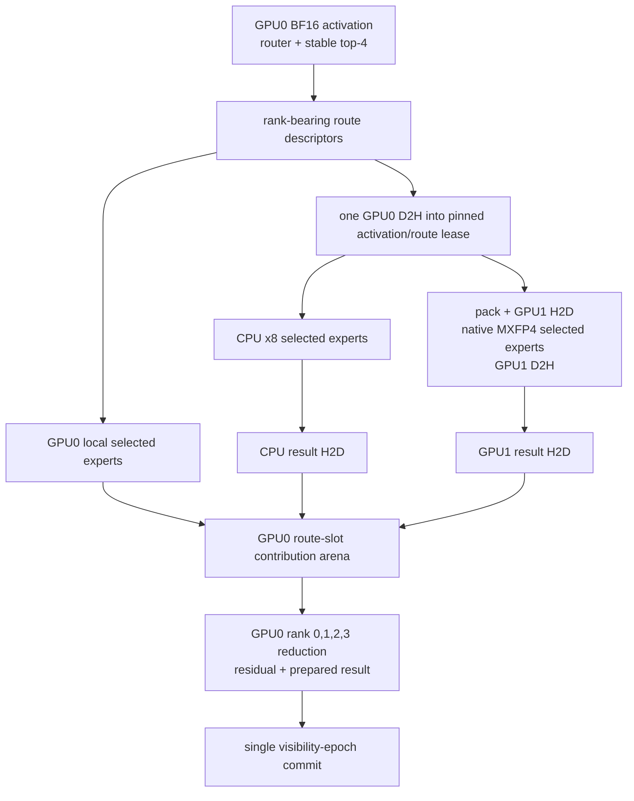

# Target architecture

## One selected architecture

The first production proof uses a **GPU-layer-owner executor with static,
single-owner experts**:

- **GPU0 / layer owner:** attention, provisional K/V, post-attention
  normalization, router projection and exact stable top-4, GPU0-local experts,
  rank-ordered weighting/reduction, residual, later dense layers, logits, and
  the authoritative prepared result.
- **GPU1 / remote expert worker:** immutable native-packed experts assigned to
  it; packed activation H2D, selected-expert execution, and unweighted BF16
  result D2H. It owns no request, K/V, router, reduction, or token state.
- **CPU / host expert worker:** immutable x8 experts assigned to it and exact
  CPU expert execution. It owns no request, K/V, router, reduction, or token
  state.
- **Engine transaction coordinator:** immutable placement resolution, bounded
  queue/buffer leases, job dispatch/drain, failure collection, and the single
  visibility epoch. It does not implement MoE arithmetic.

The label GPU0 is a role, **not CUDA ordinal 0**. A placement manifest stores a
normalized PCI domain:bus:device.function identity plus expected device model,
compute capability, and minimum memory. Startup enumerates CUDA devices,
resolves that identity to a transient ordinal, and rejects missing, duplicate,
or mismatched identities. `gpt-oss-gpu/src/device.rs` currently exposes only
ordinal/name/capability/memory; H1 adds the stable identity query. Enumeration
changes therefore cannot silently swap layer owner and expert worker.

## Dataflow



Every vague edge has this concrete first-proof meaning:

| Edge | Source → destination and owner | Dtype / logical shape / bound | Copy and dependency | Drain and evidence |
|---|---|---|---|---|
| A→B | GPU0 owner memory → GPU0 route arena | BF16 activation `[M,2880]`; four descriptors per row containing row, rank, expert, BF16-weight bits | Exact GPU0 router kernel on owner compute stream; records `routes_ready` | Arena belongs to prepared step; exact IDs/ranks/weights and kernel interval retained |
| B→C | GPU0 route arena → GPU0 selected-expert wrapper | Selected local descriptors; decode at most four rows of 5,760 B | Owner compute stream after `routes_ready`; no host copy | Local result event and per-route result identity required before reduction |
| B→D | GPU0 activation/route arenas → one pinned host lease | Decode activation 5,760 B plus at most 64 B descriptor record; prefill formula in document 25 | GPU0 relay stream waits `routes_ready`, then async D2H. One activation download feeds CPU and GPU1 packing | Lease cannot return until GPU0 D2H, host readers, and any later GPU1 H2D finish; bytes and event interval retained |
| D→E | Pinned activation lease → CPU worker | BF16 rows referenced by route descriptors; no weight transfer | Bounded CPU queue receives an immutable borrowed lease after D2H completion | CPU join must finish even after cancellation; queue wait/kernel/copy time and output hash retained |
| D→F | Pinned source → GPU1 packed input → GPU1 result → pinned result | BF16 activation/output; decode each direction ≤ 4×5,760 = 23,040 B | Host stable pack, GPU1 work stream H2D→kernel sequence→D2H; no P2P/NCCL | GPU1 terminal event protects both pinned regions and scratch; pack/copy/kernel timestamps retained |
| C/E/F→G | Three result owners → fixed GPU0 route slots | Unweighted BF16 `[M,4,2880]`; decode arena 23,040 B | Local result already resident; CPU and GPU1 results use explicit GPU0 relay-stream H2D into their rank slots | Each of `M×4` slots must have one matching descriptor; event and owner identity retained |
| G→J | GPU0 contribution arena → owner layer output | BF16 expert outputs + BF16 weights; f32 multiply/add strictly rank 0→3; BF16 output `[M,2880]` | Owner compute stream waits local and both remote-ready events, then deterministic reduction/residual | Missing/duplicate rank fails before arithmetic; intermediate comparison points retained |
| J→K | Prepared step → engine-owned canonical state | Private K/V lease, output/token/accounting image, evidence draft | Exclusive host commit validates revision/cancellation/placement and advances one visibility epoch last | Every device/host job is already drained; commit/discard terminal record published atomically |

## Router-to-expert seam

The seam is GPT-OSS-routed but not service-aware:

```text
BF16 activation rows + [{source_row, rank, expert_id, BF16 weight bits}]
    + immutable placement and expert handles
  -> bounded per-owner selected-expert jobs
  -> [{source_row, rank, expert_id, BF16 unweighted output[2880]}]
```

Routing and final weighting/reduction remain model-owned. Expert backends know
GPT-OSS MXFP4 and GPT SwiGLU. They do not know attention, K/V, RoPE, Harmony,
tokenization, sampling, or request protocol. The precise crate contracts are in
[document 22](22-expert-contract-and-interfaces.md).

## Placement manifest

`GptOssExpertPlacementManifestV1` is immutable and content-hashed. It binds:

- checkpoint revision plus config/index/mapping identities;
- a stable layer-owner PCI identity and remote-worker PCI identity;
- exact model dimensions and representation versions;
- one assignment for every `(layer, expert)` and quotas/high-water budgets;
- a `proof` or `performance` policy class and deterministic policy seed; and
- the manifest schema/version and creation provenance.

Validation occurs before any expert materialization: devices resolve, every key
in the configured layer/expert rectangle occurs once, no unknown key occurs,
owner quotas fit the approved envelope, representation matches owner, and GPU0
and GPU1 identities differ. The resolved ordinal map is process-local and is
not part of the durable assignment meaning.

The 20B proof manifest pins the known retained layer-0 routes so expert 31 is
GPU0-owned, 21 CPU-owned, 22 GPU1-owned, and 6 GPU0-owned; the remaining
experts receive one deterministic owner. This makes the existing real route
`[31,21,22,6]` a three-owner proof without fabricating routing. The 120B proof
manifest uses a deterministic, quota-balanced hash assignment. H9 must observe
a real layer using all three owners; if it does not, the proof has not passed.
Any new placement requires complete unload/reconstruction and a new manifest
hash—never live migration.

## Queues, buffers, and completion

The first proof admits one heterogeneous prepared step per sequence and one
active layer dispatch per coordinator. CPU and GPU1 queues each have capacity
one; enqueue either succeeds as part of an all-or-nothing dispatch reservation
or the layer remains undispatched. Pinned and device arenas are leased from
hard-capped size-class pools. `PinnedPool::acquire` currently allocates on
empty, so it is a low-level allocation candidate, not the required bounded
pool contract.

GPU0 has an owner compute stream and a relay stream. GPU1 has one ordered work
stream for H2D, selected-expert kernels, and D2H. Explicit CUDA events connect
streams; host joins never infer completion from enqueue return. Within a layer,
GPU0 local work, CPU work, and GPU1 work may overlap. Cross-step pipelining is
out of scope for the proof.

## Decode and prefill

Decode is the first promotion path: `M=1`, at most four routes, fixed route-slot
arena, and no expert weight movement. It is the H2/H4/H6 critical path.

Prefill uses the same descriptor/result semantics but chunks rows at a
configured, evidence-recorded bound; the initial plan uses `C=64`, covering the
observed 63-token control while bounding at most 256 route descriptors. Until a
grouped CUDA selected-expert kernel is separately promoted, the explicit
correctness path invokes the exact `M=1` primitive in stable route order for
GPU buckets and the current exact CPU batch path for CPU buckets. Unsupported
larger shapes fail; they never enter the rejected current CUDA prefill path.
Grouped prefill optimization is H10 work after exact retained proofs.

## Source/module map

No new crate is proposed.

| Logical component | Existing source reused or extended | Explicit proposed module if the invariant is absent |
|---|---|---|
| Stable route semantics | `gpt-oss-moe-semantics/src/lib.rs`; `cpu_runner.rs::moe_batch` | `gpt-oss-model-runner/src/heterogeneous/{contract,packing}.rs` for BF16-bit descriptors and route-slot preservation |
| Placement and stable device resolution | ordinal-only `gpt-oss-gpu/src/device.rs` | extend `device.rs`; add `heterogeneous/placement.rs` in model runner |
| Native views and owner construction | `cpu_tensor_store.rs`, `cpu_repack.rs`, `model_loader/gpu_loader.rs` | `model_loader/gpt_oss_native.rs` and `model_loader/owner_selective.rs` |
| CUDA selected expert and reduction | low-level `gpu_layer.rs`, `kernels/gpt_oss_moe.cu`, `kernel_loader.rs` | `heterogeneous/cuda_expert.rs`, `heterogeneous/reduction.rs`, and `kernels/gpt_oss_selected_expert.cu` |
| Events and bounded pinned leases | `gpt-oss-gpu/src/pinned_memory.rs`; cudarc streams in runner | `gpt-oss-gpu/src/event.rs`; bounded lease adapter in `pinned_memory.rs` |
| CPU/GPU1 workers and coordinator | `worker/gpu_worker.rs` channel/launch concepts; CPU exact runner | `gpt-oss-engine/src/worker/heterogeneous_worker.rs` and `heterogeneous_engine.rs` |
| Private K/V lease and epoch commit | raw `KVCache`; current `gpu_engine.rs` scheduling/allocation | focused transaction types in `heterogeneous_engine.rs`, with cache metadata adapters in existing K/V modules |
| Evidence | `gpt-oss-evidence/src/lib.rs::RunManifestV1` and artifact references | `HeterogeneousStepTraceV1` artifact types in the same crate |

Existing CUDA dense/attention code is reusable only after its tier-specific
oracle gates. Existing worker channels are reusable only as mechanics; TP
rank, NCCL, global/local sharding, and rank-0 output assumptions are excluded.

## Control path and rejected alternatives

The full exact CPU path and a host-owned MoE coordinator remain oracle/control
paths. They may diagnose a first divergence; they are not silent production
fallbacks after dispatch.

Rejected for the first proof: host-owned reduction as the target, alternating
layer ownership, tensor parallel/NCCL execution, P2P, weight streaming,
duplicate experts, current CUDA all-expert decode, current host-f32 CUDA
prefill, and any fallback that changes owner after a job begins. Their evidence
and reasons remain in [documents 16](16-current-path-validation.md) and
[18](18-design-candidates.md).
