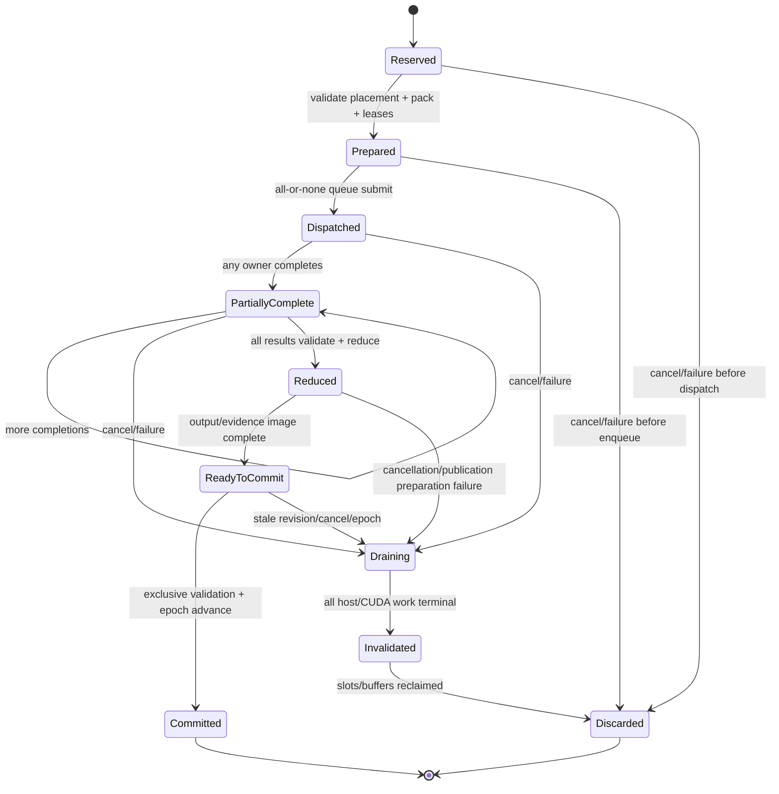

# Transaction, failure, and cancellation plan

## Selected commit model

Phase 2 selects **private append slots with a single visibility epoch**.

This is not a claim that the current GPU path is transactional. Source shows:

- `kv_cache/cache.rs::KVCache` is raw physical storage and has no visible
  sequence length or resident block table;
- `worker/input.rs::prepare_decode` derives slot mapping, block table, and
  context length entirely from supplied sequence metadata;
- `gpu_layer.rs` writes K/V, then attention reads it on the same runner stream,
  so a step can have a private read-your-writes view;
- `gpu_engine.rs::FifoScheduler` appends a sampled token only in
  `process_worker_outputs`, after the worker returns; but
- current `GpuLLMEngine::build_metadata` mutates global `seq_block_tables`
  before launch, prefix registration occurs before a transaction boundary, and
  `step_launch` has no one-in-flight guard.

The first three facts make private slots possible without a second K/V tensor.
The last fact means current behavior must be replaced at H5, not reused as-is.
The required change is confined to allocation metadata, in-flight ownership,
and publication; K/V kernel layouts remain unchanged.

## Why fully staged state is not selected

| Model | Safety | Peak/copy cost | Source adaptation | Decision |
|---|---|---|---|---|
| Fully staged K/V/output | Separate K/V makes discard obvious | Duplicates every prepared layer's K/V and requires a device copy or pointer swap at commit; bounded decode is small, but chunked prefill and cache capacity grow; exact peak/copy is unmeasured | Current attention kernels expect the normal paged cache; a second cache/pointer swap spans every layer and graph path | Safe fallback design, but broader cache rewrite and higher peak |
| Private append + epoch | Safe only if unpublished table/length is unreachable and reuse waits for drain | Writes final physical slots once; metadata commit only | Current cache addressing is already explicit. Needs a generation lease, one-in-flight guard, deferred table/prefix/token publication, and exclusive commit | **Selected**; smaller reviewable lifecycle extension |

Private slots are rejected automatically if H5 proves any reader can address an
unpublished slot or a step can race another step for the sequence. H5 then
stops; it does not silently switch models. Returning to fully staged state
would require a new reviewed plan/memory envelope.

## Core objects

`ProvisionalKvLease` owns:

- sequence ID, expected request revision and visibility epoch;
- the committed block table/length snapshot;
- a private table containing the committed blocks plus any newly leased block;
- exact private slot mappings and context lengths used by this step;
- `(block_id, generation)` for every newly leased block and the generation of
  an existing partial tail block;
- GPU0 K/V events that can still reference those slots; and
- `committable`, `invalidated`, and `drained` flags.

The block allocator maintains a host generation counter per physical block.
Allocation/recycle increments it. A prepared ticket whose generation no longer
matches cannot dispatch or commit. Raw CUDA cache entries need no device-side
visibility flag because only explicit table/length metadata can address them.

`GpuSequenceVisibility` is created at request admission and contains committed
length, committed block-table identity, request revision, placement epoch, and
visibility epoch. Existing scheduler/request structures remain private to the
engine; a prepared `SequenceCommitImage` contains replacement values for all of
them.

## Visibility rule and atomic publication

Before dispatch, the engine reserves every vector/map slot and builds all
potentially fallible replacements. Before `ReadyToCommit`, it finishes
sampling/output formatting, token accounting, evidence serialization/hash,
result validation, and all device/host drains. The commit method holds exclusive
`&mut GpuLLMEngine` access and revalidates sequence revision, cancellation,
placement epoch, block generations, and in-flight step identity.

Commit then performs only prevalidated, allocation-free replacements:

1. install the prepared block-table/length image;
2. replace the scheduler sequence/token image;
3. replace request output/accounting and the in-memory evidence record;
4. mark the lease committed; and
5. increment `GpuSequenceVisibility.visibility_epoch` **last**.

The epoch increment is the single visibility operation. No engine reader runs
during the exclusive commit. Subsequent scheduling/output reads accept only the
new epoch; asynchronous request/abort queues do not inspect sequence state.
External response delivery occurs after commit from the committed image.

For the first proof, prefix caching is disabled. A later enablement must insert
actual committed block IDs only after the epoch advances; the current
pre-commit registration is not allowed.

K/V bytes written into a private slot are visible only to kernels in the same
prepared step, whose private metadata includes the new length. Global committed
length/table, request tokens, logits/output, token counts, and authoritative
evidence remain at the old epoch.

## State machine

`PartiallyComplete` never exposes a partial contribution. An error/cancellation
sets `publication_forbidden` monotonically. If reduction was already enqueued,
it drains but its output is discarded. No transition returns from draining to
ready-to-commit.

## Ten-question selection test

1. **Where is next K/V placed?** In final physical GPU0 cache slots. New blocks
   belong to `ProvisionalKvLease`; a partial-tail write uses only offsets beyond
   committed length. Every layer's write is addressed through the lease's
   private slot map.
2. **Who can read before commit?** Only kernels owned by that prepared step,
   using its private table/context. The scheduler, prefix cache, output path,
   later step, and other request use committed metadata. One in-flight step per
   sequence is enforced.
3. **What makes it visible?** The allocation-free exclusive commit followed by
   one `visibility_epoch` increment. That increment is last.
4. **GPU1 finishes after CPU fails?** Publication is forbidden. GPU1 and all
   GPU0 work drain; its result is ignored; K/V lease is invalidated; only after
   terminal events do buffers/new blocks return to pools. Epoch/revision do not
   change.
5. **Cancellation after all expert kernels but before reduction?** Reduction is
   not enqueued; if a race already enqueued it, it drains. The prepared result
   and private K/V are discarded without publication.
6. **Reduction succeeds but output publication fails?** Fallible sampling,
   formatting, accounting, and evidence-image preparation occur before
   `ReadyToCommit`; failure there drains/discards with old epoch. A client
   channel failure after the epoch advances does not roll back committed K/V or
   token state; it closes/aborts delivery from a consistently committed state
   and records delivery failure separately.
7. **What must drain before discard?** GPU0 owner/relay/reduction events, GPU1
   H2D/kernel/D2H event, CPU jobs, every DMA reference to pinned memory, and any
   already-enqueued cleanup. Device/context teardown may substitute only if it
   proves quiescence.
8. **How is reuse prevented?** Step-owned leases carry generation and outstanding
   completion handles. Only the drain coordinator can return them, after every
   handle is terminal. Pool `Drop` cannot bypass that rule.
9. **How is a partial append invalidated?** Committed length/table/epoch stay
   unchanged. A dirty unused tail slot is overwritten before any later private
   context can include it. A new block's generation increments before it
   returns to free state; later allocation must write all addressable slots
   before attention reads them. Stale tickets fail generation validation.
10. **How does shutdown prove quiescence?** Stop admission, mark queued/active
    steps publication-forbidden, join/drain every worker and event, discard
    private leases, require zero active queue tickets/buffer leases/block leases,
    publish terminal evidence, and only then drop immutable weights, streams,
    and contexts.

## Cancellation and fallback

Cancellation before dispatch releases the reservation immediately. After any
job enqueue, it stops new work where possible, marks publication forbidden,
and enters mandatory drain. CUDA kernels are treated as non-cancelable after
launch. Host CPU code may observe a cooperative cancellation flag between
expert jobs, but a started projection owns its input/output until its join.

Static single ownership means there is no duplicate expert to fail over to.
Fallback is safe only before dispatch, or after complete drain/discard followed
by a wholly new step with unchanged committed revision and a separately valid
placement. Owner substitution, zero fill, partial reduction, retry on a
possibly poisoned stream, and buffer reuse during DMA are forbidden.

## Deterministic error precedence

The coordinator drains and retains all observed errors, then applies the fixed
ordering in [document 22](22-expert-contract-and-interfaces.md): invariant
violations first; then reserve→pack→queue→H2D→kernel→D2H→reduction→publication;
within a stage GPU0→CPU→GPU1→route slot; cancellation next; cleanup/drain errors
secondary unless alone. Thus scheduling races cannot change the primary error.

If cancellation and a device error coexist, the device error is primary and
cancellation is attached. A host panic is caught at the worker boundary and
classified as CPU failure. Cleanup never replaces an earlier execution error,
but poisoned capacity is quarantined.

## Failure-injection matrix

| Injection | Required observation | Required state/cleanup |
|---|---|---|
| Placement/owner missing or duplicate | Fails before allocation/dispatch; exact key in evidence | No lease, queue job, K/V write, or epoch change |
| Pinned/device/scratch/block allocation failure | Fixed `Reservation` error; no partial dispatch | Reverse-release completed reservations; no manifest owner registered twice |
| CPU queue rejection | Fails all-or-none dispatch | No GPU enqueue; leases released |
| CPU panic/arithmetic failure after dispatch | CPU primary error unless earlier invariant | Drain both GPUs; no reduction/publication; CPU lease joins |
| GPU0 router/local kernel failure | GPU0 kernel error | Drain relay/GPU1/CPU if issued; invalidate private K/V |
| GPU0 D2H or result H2D failure | Direction/bytes/event recorded | Drain referencing streams; quarantine uncertain pinned/device regions |
| GPU1 H2D failure | GPU1 H2D error | No GPU1 kernel if dependency prevents it; drain GPU0/CPU |
| GPU1 selected-expert kernel failure | GPU1 kernel error | D2H not trusted; drain terminal event/context; no result slot accepted |
| GPU1 D2H failure | GPU1 D2H error | Host result invalid; drain before pinned reuse |
| Missing/duplicate/mismatched result | `ResultIdentity` invariant error | No reduction; all jobs already drained or enter drain |
| Owner reduction failure | GPU0 reduction error | Drain reduction; discard complete but unpublished K/V/output |
| Cancellation at reserve/prepare | `Cancelled`, no jobs | Immediate deterministic release |
| Cancellation after each enqueue/completion boundary | `Cancelled` if no other error | No epoch; all started work drains; repeat across CPU/GPU0/GPU1 orderings |
| Stale revision/epoch/placement at commit | Commit validation error | Prepared output discarded; committed state unchanged |
| Output/evidence image preparation failure | Publication-preparation error | No commit; drain/discard |
| External output channel failure after commit | Delivery error attached to committed epoch | No rollback; request becomes terminal/aborted consistently |
| Cleanup/free failure | Original error primary; cleanup attached | Capacity quarantined, not returned to pool |
| Shutdown with queued and active work | Admission closes; terminal drain record | Zero active tickets/events/leases before context drop |
| Simultaneous CPU and GPU1 failures | Fixed stage/owner precedence, both retained | Same primary result on repeated timing permutations |

Each injection runs before and after a successful step and is followed by a
second request/load where applicable. The second run must not observe stale K/V,
stale result slots, reused event generations, allocation growth, or changed
token/accounting state from the discarded step.

## Evidence visibility

An active evidence draft is request-private. On success, its serialized/hash
image is installed with the commit image and becomes authoritative at the same
epoch; durable file publication follows atomically. On failure/cancellation, a
terminal discarded record becomes publishable only after drain and
invalidation. A durable writer failure after an otherwise committed step marks
the proof run invalid but cannot roll back model state. H6/H9 pass only with a
durable complete artifact.
